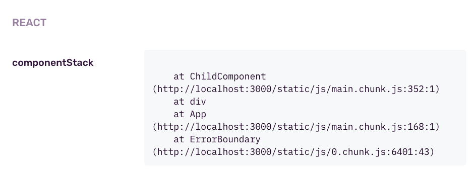
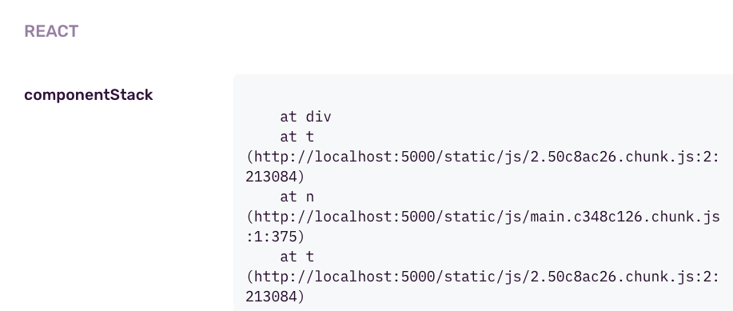

## Description
Test react error boundary handling by Sentry. Example taken from https://docs.sentry.io/platforms/javascript/guides/react/components/errorboundary/#setting-a-fallback-function-render-props

The "component stack" spoken of here is viewable on the Sentry Issue like:

## Setup
`npm install`

## Run

1. `npm run build`
2. `./node_modules/serve/bin/serve.js -s build`

or both at once:
`npm run build && ./node_modules/serve/bin/serve.js -s build`

## Troubleshooting
If you'd like to use `npm start` instead, then uncomment the code in componentDidMount in App.js, and this will cause an error and the Sentry Issue will have the Component Stack shown. The fallback component will not render in development mode from npm start. This is why the readme instructions are for `npm run build` for a production mode.

If you use npm run build but don't upload sourcemaps, then your Component Stack info will look minified just like your source bundle. This is a common problem that customers may encounter:  
